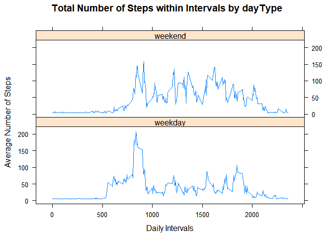

```r
knitr::opts_chunk$set(fig.path='Figs/')
```


```r
library(ggplot2)
library(dplyr)
library(mice)
library(lattice)
```


## Loading and preprocessing the data


```r
activity <- read.csv("activity.csv")
#structure:
str(activity)
```

```
## 'data.frame':	17568 obs. of  3 variables:
##  $ steps   : int  NA NA NA NA NA NA NA NA NA NA ...
##  $ date    : chr  "2012-10-01" "2012-10-01" "2012-10-01" "2012-10-01" ...
##  $ interval: int  0 5 10 15 20 25 30 35 40 45 ...
```

```r
#data:
head(activity)
```

```
##   steps       date interval
## 1    NA 2012-10-01        0
## 2    NA 2012-10-01        5
## 3    NA 2012-10-01       10
## 4    NA 2012-10-01       15
## 5    NA 2012-10-01       20
## 6    NA 2012-10-01       25
```


```r
#aggregating data by day:
day<-aggregate(steps~date,activity,sum)
head(day)
```

```
##         date steps
## 1 2012-10-02   126
## 2 2012-10-03 11352
## 3 2012-10-04 12116
## 4 2012-10-05 13294
## 5 2012-10-06 15420
## 6 2012-10-07 11015
```


## What is mean total number of steps taken per day?


```r
mea=mean(day$steps)
med=median(day$steps)

rbind(mea,med)
```

```
##         [,1]
## mea 10766.19
## med 10765.00
```


```r
p1=ggplot(data=day,aes(x=steps))+
        geom_histogram(bins=30,fill="plum2")+
        ggtitle("Steps taken per day")
        

p2=p1+geom_vline(xintercept = mean(day$steps),size=1,
                 colour="blue",alpha=0.5,linetype="dashed")
                   
p3=p2+ annotate(geom = "text",x=mean(day$steps),y = 7.5,label="mean",angle=90)

p3
```

<!-- -->


## What is the average daily activity pattern?

```r
#aggregating data by interval:
inter<-aggregate(steps~interval,activity,mean)
head(inter)
```

```
##   interval     steps
## 1        0 1.7169811
## 2        5 0.3396226
## 3       10 0.1320755
## 4       15 0.1509434
## 5       20 0.0754717
## 6       25 2.0943396
```


```r
plot(x=inter$interval,y=inter$steps,
     type = "l",
     col="red",
     main = "Average daily activity pattern")
```

<!-- -->

```r
# 5-minute interval that contains the maximum number of steps
which.max(inter$steps)
```

```
## [1] 104
```

```r
inter[104,]
```

```
##     interval    steps
## 104      835 206.1698
```

```r
#answer
paste("The interval is 835")
```

```
## [1] "The interval is 835"
```


## Imputing missing values

```r
#total missing values:
sum(is.na(activity))
```

```
## [1] 2304
```

```r
#with mice package:
md.pattern(activity,plot=T)
```

<!-- -->

```
##       date interval steps     
## 15264    1        1     1    0
## 2304     1        1     0    1
##          0        0  2304 2304
```

```r
missing<-is.na(activity[,1])
```

-  I will fill in all of the missing values in the dataset by the mean number of steps per interval.


```r
#mean number of steps per interval
m<-mean(inter$steps)
```


```r
activityfull<-activity
activityfull[missing,1]<-m
head(activityfull)
```

```
##     steps       date interval
## 1 37.3826 2012-10-01        0
## 2 37.3826 2012-10-01        5
## 3 37.3826 2012-10-01       10
## 4 37.3826 2012-10-01       15
## 5 37.3826 2012-10-01       20
## 6 37.3826 2012-10-01       25
```

```r
#aggregating data by day:
dayfull<-aggregate(steps~date,activityfull,sum)
head(dayfull)
```

```
##         date    steps
## 1 2012-10-01 10766.19
## 2 2012-10-02   126.00
## 3 2012-10-03 11352.00
## 4 2012-10-04 12116.00
## 5 2012-10-05 13294.00
## 6 2012-10-06 15420.00
```

```r
mea_full=mean(dayfull$steps)
med_full=median(dayfull$steps)

rbind(mea_full,med_full)
```

```
##              [,1]
## mea_full 10766.19
## med_full 10766.19
```


```r
g1=ggplot(data=dayfull,aes(x=steps))+
        geom_histogram(bins=30,fill="blue")+
        ggtitle("Steps taken per day")
        
g1
```

<!-- -->


```r
rbind(mea,mea_full,med,med_full)
```

```
##              [,1]
## mea      10766.19
## mea_full 10766.19
## med      10765.00
## med_full 10766.19
```


**Since I imputed the missing values by the mean number of steps per interval, there is no difference in mean before and after imputing, that is not surprising. The median has changed a little bit.**


## Are there differences in activity patterns between weekdays and weekends?


```r
activityfull$date<-as.Date(activityfull$date)

activityfull$days<-weekdays(activityfull$date)


str(activityfull)
```

```
## 'data.frame':	17568 obs. of  4 variables:
##  $ steps   : num  37.4 37.4 37.4 37.4 37.4 ...
##  $ date    : Date, format: "2012-10-01" "2012-10-01" ...
##  $ interval: int  0 5 10 15 20 25 30 35 40 45 ...
##  $ days    : chr  "lundi" "lundi" "lundi" "lundi" ...
```


```r
activityfull<-activityfull%>%mutate(daytype=ifelse(days=="samedi"|days=="dimanche", "weekend","weekday"))

activityfull$daytype<-as.factor(activityfull$daytype)
str(activityfull)
```

```
## 'data.frame':	17568 obs. of  5 variables:
##  $ steps   : num  37.4 37.4 37.4 37.4 37.4 ...
##  $ date    : Date, format: "2012-10-01" "2012-10-01" ...
##  $ interval: int  0 5 10 15 20 25 30 35 40 45 ...
##  $ days    : chr  "lundi" "lundi" "lundi" "lundi" ...
##  $ daytype : Factor w/ 2 levels "weekday","weekend": 1 1 1 1 1 1 1 1 1 1 ...
```


```r
#with aggregate:
agg<-aggregate(steps ~ daytype+interval, data=activityfull, FUN=mean)

xyplot(steps~interval | daytype,
       data=agg,
       type="l",
      main = "Total Number of Steps within Intervals by dayType",
      xlab = "Daily Intervals",
      ylab = "Average Number of Steps",
       layout=c(1,2))
```

<!-- -->


